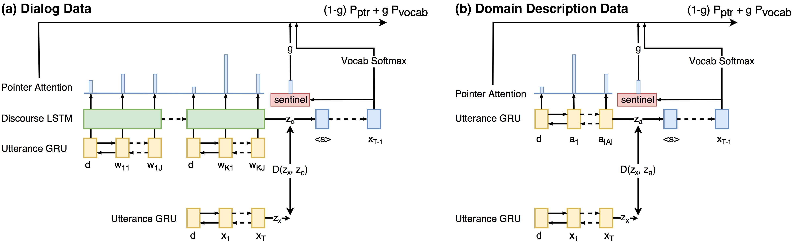

# Zero-shot Dialog Generation (ZSDG) for End-to-end Neural Dialog Models
Codebase for [Zero-Shot Dialog Generation with Cross-Domain Latent Actions](https://arxiv.org/abs/1805.04803), published as a long paper in SIGDIAL 2018. Reference information is in the end of this page. Presentation [slides](https://www.cs.cmu.edu/~tianchez/data/SIGIDIAL2018-talk.pdf) can be found here.

This work won the [**best paper award**](http://workshops.sigdial.org/conference19/proceedings.html#bestpapercandidates) at SIGDIAL 2018.

  

If you use any source codes or datasets included in this toolkit in your work, please cite the following paper. The bibtex are listed below:
   
    @article{zhao2018zero,
      title={Zero-Shot Dialog Generation with Cross-Domain Latent Actions},
      author={Zhao, Tiancheng and Eskenazi, Maxine},
      journal={arXiv preprint arXiv:1805.04803},
      year={2018}
    }

## Requirements
    python 2.7
    pytorch >= 0.3.0.post4
    numpy
    nltk
    
## Datasets
The *data* folder contains three datasets:
- [SimDial Data](https://github.com/snakeztc/NeuralDialog-ZSDG/tree/master/data/simdial): synthetic multi-domain dialog generator. The data generator can be found [here](https://github.com/snakeztc/SimDial)
- [Stanford Multi-domain Dialog](https://nlp.stanford.edu/blog/a-new-multi-turn-multi-domain-task-oriented-dialogue-dataset/): human-woz task-oriented dialogs.

## Getting Started

The following scripts implement 4 different models, including:
- Baseline: standard *attentional encoder-decoder* and *encoder with pointer-sentinel-mixture decoder* (see the paper for details).
- Out Models: cross-domain **Action Matching** training for the above two baseline systems. 

### Training

Run the following to experiment on the SimDial dataset

    python simdial-zsdg.py
    
Run the following to experiment on the Stanford Multi-Domain Dataset

    python stanford-zsdg.py
    
    
### Switching Model

The hyperparameters are exactly the same for the above two scripts. To train different models, use the following 
configurations. The following examples are for *simdial-zsdg.py*, which also apply to stanford-zsdg.py.

For baseline model with attetnion decoder:

    python simdial-zsdg.py --action_match False --use_ptr False
    
For baseline model with pointer-sentinel mixture decoder:

    python simdial-zsdg.py --action_match False --use_ptr True    
    
For action matching model with attetnion decoder:

    python simdial-zsdg.py --action_match True --use_ptr False
    
For action matching model with attetnion decoder:

    python simdial-zsdg.py --action_match True --use_ptr True    

### Hyperparameters
The following are some of key hyperparameters:

- action_match: if or not using the proposed AM algorithm for training
- target_example_cnt: the number of *seed response* from each domain used for training.
- use_ptr: if or not using pointer-sentinel-mixture decoder
- black_domains: define which domains are excluded from training
- black_ratio: the percentage of training data from black_domains are excluded. Range=[0,1], where 1 means removed 
100% of the training data.
- forward_only: use existing model or train a new one
- load_sess: the path to the existing model
- rnn_cell: the type of RNN cell, supporting LSTM or GRU
- dropout: the chance for dropout.

### Test a existing model
All trained models and log files are saved to the *log* folder. To run a existing model, you can:

- Set the forward_only argument to be True
- Set the load_sess argument to te the path to the model folder in *log*
- Run the script 

